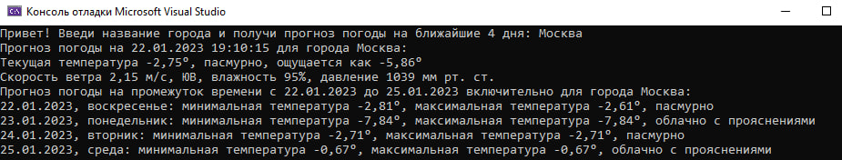

# Интеграция с 📌https://openweathermap.org/ (Прогноз погоды)
__Задание__
---
Разработать консольное приложение по интеграции с АПИ погодного сервиса:
- Запросить у пользователя город;
- Показать следующие параметры:
- Текущая температура;
- Описание (Ясно, пасмурно и т.д.);
- Ощущается как;
- Скорость ветра, направление;
- Влажность;
- Давление рт.ст.
Коротко-срочный прогноз на 4 дня:
- Дата;
- День недели;
- Температура макс и мин;
- Описание (Ясно, облачно и т.п.).
---
## Результат:

---
___Работу выполнил студент группы ИП - 19 - 3 Стешкин Георгий___